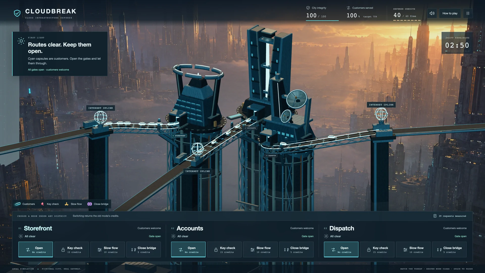
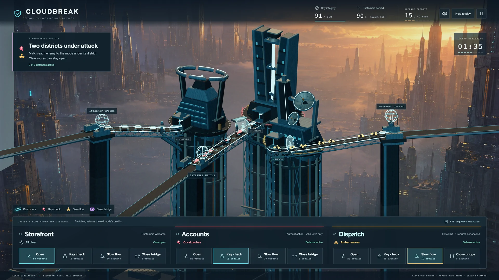
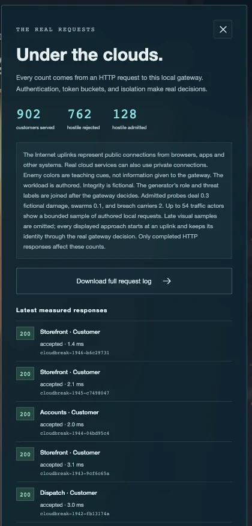

https://github.com/user-attachments/assets/fa876bb4-e1d5-472f-99e4-a66fa665ca7a

*Inline player: compressed 4K · [Download the high-quality 4K master](https://github.com/JarthurLabs/cloudbreak/releases/download/v0.1.0/Cloudbreak-4k-Demo.mp4)*

# Cloudbreak

I wanted to make protecting a cloud service feel like a decision you could see.

Cloudbreak is a three-minute browser game about keeping a futuristic city online while different attacks arrive through its Internet connections. The buildings are services. Cyan traffic represents customers. Your job is to stop the threats without shutting out too many of the people the city is supposed to serve.

I'm Nicholas. I built this with Codex, directing the gameplay, visuals, onboarding, balance, and sound through repeated playthroughs and reviews. Codex handled implementation, automated checks, and gameplay captures. My feedback shaped the game that came out of that process.

## Play it

**[Play Cloudbreak in your browser](https://cloudbreak.onrender.com/)**

Open the playable link on your phone or desktop; no GitHub account is needed. Read the quick briefing, then choose **Begin First Light**. On a phone, tap a district, then choose one of its four defenses. The other district alerts stay visible. On desktop, click a defense beneath any building. Keep city integrity above zero for three minutes and serve at least 75 percent of customers. Later attacks happen in several districts at once.

Keyboard controls are optional: 1–3 select a district, A checks keys, R slows traffic, I closes the bridge, O opens it, and Space pauses. Pause also gives you music, volume, and reduced-motion settings.

The game runs on free hosting, so an idle service may need time to wake up. [Hosting behavior and limits](docs/HOSTING.md).



*Storefront, Accounts, and Dispatch share the same problem: useful traffic and attacks arrive through the same connections.*

## Three threats, three different decisions

**Coral probes have bad keys.** Use **Key check** to reject them. This introduces authentication: checking the credential a request presents. A working key can still belong to an attacker.

**Amber swarms arrive too quickly.** Use **Slow flow** to limit the route to one request per second. This reduces the rush, but customers share that limit and some hostile requests can still pass.

**Violet carriers arrive slowly with working keys and cause heavy damage.** Use **Close bridge** to isolate the route temporarily. That stops every arrival, including customers. Reopen when the route is clear.

You have 40 reusable defense credits. Switching a mode returns its old reservation. The challenge is deciding where a restriction helps, where it costs too much service, and when to remove it.



*Authentication checks credentials. Rate limiting controls volume. Isolation stops the route. They solve different problems.*

## How it took shape

The first city sat in soft white clouds, and its little customer objects looked like dice. I liked the central idea, but the look did not feel like defending an environment under attack. I asked for a much larger futuristic city above a gritty undercity, three distinct technology buildings, and traffic routes that connected to something believable.

The gameplay needed the same kind of review. The tutorial made me click through too many steps. Alerts interrupted play. Gates felt slow, and activating one appeared to reset the enemies already approaching it. Reasonable runs also lost too much integrity.

We changed those individually: a short briefing, direct controls, warnings that stay in the world, fast gates, continuous request identities, and more forgiving damage. Internet uplinks gave traffic a visible origin. Local building light and movement replaced the whole-screen damage shake.

Playing on my phone exposed another problem: too many words and twelve defense buttons squeezed into the same screen. I asked for a simpler mobile experience. We kept all three districts visible, showed four controls for the selected district, shortened the briefing, and moved settings into Pause. Landscape phones use a side panel. [Mobile screenshots and checks](captures/mobile/README.md).

Music took another round. The ambient options sounded too calm for a city under attack. I chose **Firewall Drive** for its stronger pulse and sense of urgency, with separate enemy effects kept in the mix.

[Read the build story, including what went wrong](docs/HOW_IT_WAS_BUILT.md)

## The cloud security connection

My experience with software-as-a-service implementation, documentation, onboarding, and troubleshooting has made me pay attention to the workflow behind a technical setting. If a change stops the problem but also prevents customers from working, that consequence needs to be understood and tested.

Cloudbreak makes that tradeoff visible. Blocking more traffic can protect the city while lowering the number of customers served. A valid credential does not settle every security question. A traffic limit reduces load without deciding whether each caller has good intentions. Isolation buys containment at the cost of availability.

The game gives me a way to practice translating those ideas into clear requirements, checking expected outcomes, and explaining why a control fits a particular problem.

[Explore the cloud security concepts and model limits](docs/CLOUD_SECURITY.md)

## Underneath the game

React and TypeScript handle the interface. Three.js renders the interactive city. A Node server sends authored HTTP requests through the game's gateway. Its authentication, token-bucket rate limit, and isolation rules produce actual response codes that feed the counters and animations.

The gateway does not receive the generator's friendly or hostile labels before deciding. Those labels are joined afterward to explain the result. The **Inspect** panel and downloadable request log show the measured responses.



*Detail from actual post-flight Inspect panel. These response codes come from actual requests to the game's own gateway.*

The release passed 53 automated tests and a clean GitHub build. The 87.5-second film uses actual normal-speed gameplay with editorial captions and opening and closing graphics. [Release recording and verification notes](captures/release/VERIFICATION.md) · [Build story and earlier checks](docs/HOW_IT_WAS_BUILT.md)

## Run it locally

With Node.js 24.19.0 installed, install the dependencies and start the game:

```sh
npm ci
npm run dev
```

Open [the local game](http://127.0.0.1:5310). To check and build the project:

```sh
npm test
npm run build
```

After building, `npm start` serves the frontend and gateway together. No cloud account, API key, or connection to a real customer environment is required.

## Scope and limits

First Light is one authored mission. The city, enemies, credits, and damage are teaching devices. Traffic is synthetic and stays within the game's own system. This is not an Azure or Amazon Web Services environment, a production security control, or a test of a real attack.

Real services often combine controls. Protected services should not drop required authentication just because an alert clears. Investigating a compromised credential can lead to revocation or a narrower restriction; closing a whole route is the blunt option available in this game.

Automated checks establish behavior, not learning outcomes or production security experience. The renderer shows a bounded sample of requests, while the evidence counts completed responses. [Art provenance](public/art/PROVENANCE.md) identifies the generated background separately from the interactive geometry. Source licensing remains undecided. Dependencies retain their own licenses.

When you're done defending the city, try [Ghost Protocol](https://ghost-protocol-b74p.onrender.com), my maze game about copied access and knowing which permission to revoke. [Its build story is on GitHub](https://github.com/JarthurLabs/ghost-protocol).
