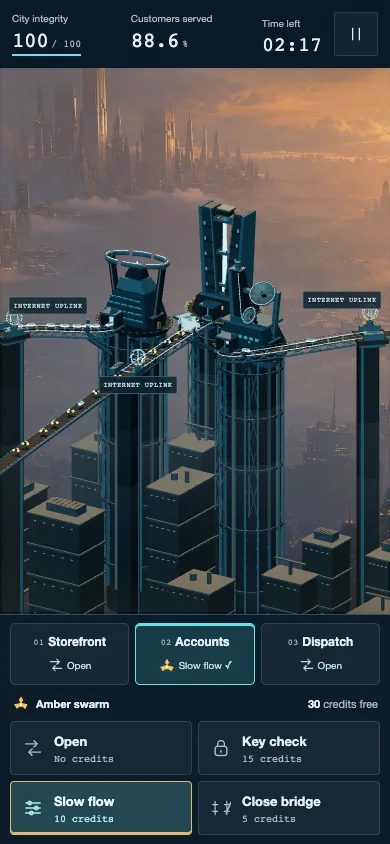
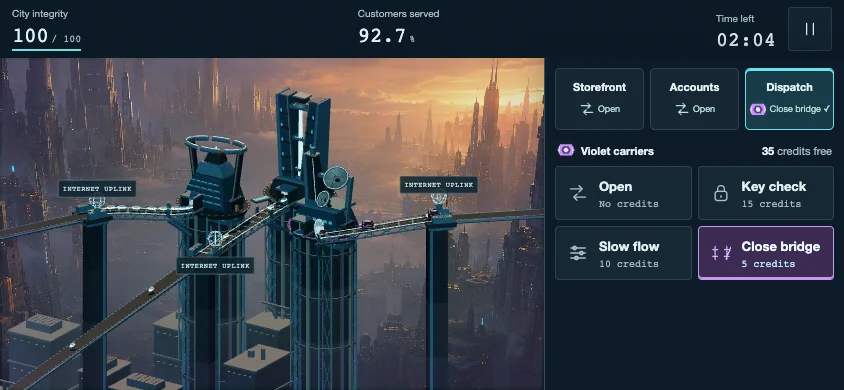

# Clearer mobile bridge arrivals

Nicholas spotted two problems in an actual phone screenshot: floating district numbers covered the gates and buildings, and traffic appeared too close to the middle gate. Mobile now uses the bottom district strip for selection. Accounts traffic enters from beyond the screen edge along the existing long bridge and passes through its Internet uplink before reaching the original gate.

[Play Cloudbreak](https://cloudbreak.onrender.com/)

[Watch the actual ten-second phone recording](accounts-arrivals-phone-silent.mp4). It is a silent review capture at 390 by 844 pixels, with original compositor timing, no sped-up play, and no interpolated gameplay. The game still uses the selected Firewall Drive soundtrack.

## Verification

The [fresh public check](public/report.json) passed against the deployed game on September 7, 2026. It observed 235 Accounts births across the five mobile sizes, six continuous actors through the protection change, and 586 real requests over 65.187 mission seconds. Paused rotation and desktop checks passed with no browser or geometry errors. The [live asset check](public-assets.json) confirms the deployed stylesheet is byte-identical to the tested version. The phone screenshot above is from that public run. Render deployed source commit `7a98a1e` successfully; the later repository update only records this evidence.

The [local report](report.json) records 233 mobile Accounts births across five portrait and landscape sizes. Every sampled birth was outside the screen boundary and within the camera depth range. The same actors entered through an edge and joined real gateway responses. Six approaching actors retained their identities, deadlines and forward progress through an Open to Slow flow change. Paused rotation preserved exact world positions. Other lanes and desktop arrivals kept their original paths.

The focused run observed about 65 mission seconds and 577 real requests; it was not a new full mission balance run. All 55 automated tests and the production build passed. No browser errors or geometry warnings were observed. These browser checks use Chrome phone emulation, not physical iPhone or Safari testing.

## What needed care

Moving the original route endpoint would also move the gate. Instead, each new mobile Accounts actor gets its own extended approach, joined to the exact original gate point. The route is frozen at birth so rotation cannot reset a visible enemy. The mobile orthographic camera also needed more depth behind the feeder to prevent landscape traffic clipping into view. Matching fog-distance offsets preserve the existing city framing and haze. Camera matrices update before arrivals are calculated, including on the first frame after rotation.

The gateway rules, request deadlines, attack schedule, damage, economy, soundtrack and desktop controls are unchanged. Source hashes and recording details are included in the report. Run `node scripts/check-mobile-arrivals.mjs` against the isolated local preview to repeat the focused checks. Public verification uses the exact game URL through `CLOUDBREAK_CHECK_URL` and writes to a separate `public` folder.
