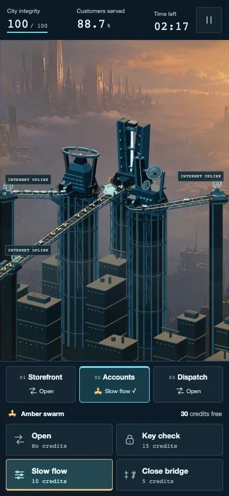
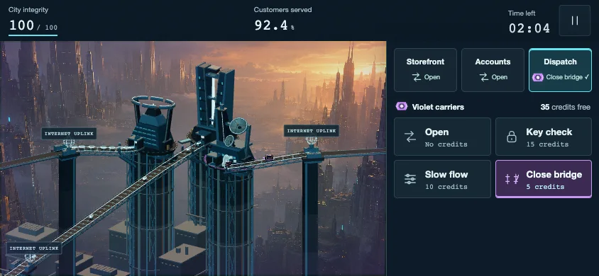

# A complete track to the Internet entry

The first mobile pass moved the traffic origin farther back but left the middle Internet uplink at its old junction, with a plain feeder behind it. Nicholas asked to move the uplink to the beginning of the incoming traffic and fill that section with matching track detail.

The actual terminal, wire globe and label now sit together at the mobile entry edge. Requests arrive from off screen and pass through the station. The full feeder uses the same dark deck, cyan rails, cross braces and sleepers as the existing bridge. The original junction is now a continuous section of track.

[Play Cloudbreak](https://cloudbreak.onrender.com/)

[Watch the actual ten-second phone clip](accounts-arrivals-phone-silent.mp4). This is a silent technical review capture, using native phone-size frames and the original gameplay clock. Firewall Drive remains the game soundtrack.

The [focused local report](report.json) checks five portrait and landscape phone sizes, desktop, paused rotation, and an actual protection change. It recorded 234 mobile Accounts births and 580 real requests over 64.463 mission seconds. Incoming actors kept their identities and deadlines; the original gate position and real gateway outcomes stayed intact. All 55 automated tests and the production build passed. The screenshots were inspected at their actual size. These are Chrome phone emulation checks, not physical iPhone or Safari tests.

The [fresh public check](public/report.json) also passed: 235 aligned Accounts births and 589 real requests over 65.656 mission seconds, all five mobile placements, paused rotation, desktop behavior, and no browser or geometry errors. The phone image above comes from that public run. [Served asset verification](public-assets.json) identifies the live build. Render deployed source `be97f0f`; the later repository update records verification and corrects the test harness only.

The terminal is just inside the screen edge while births remain outside it, so the source stays visible without making enemies appear in the road. Its placement adapts to the viewport; the detailed track is built once and each existing actor keeps its frozen path. The middle feeder also gains the matching detail on desktop, while desktop terminal positions and controls remain as before. No gateway rules, damage, schedule, economy or music were changed.

Run the focused check with `CHECK_UPLINK=1 node scripts/check-mobile-arrivals.mjs`. The exact public game URL can be passed through `CLOUDBREAK_CHECK_URL`; its evidence is saved separately under `public`.

The first public verification attempt exposed a limitation in the test: it capped forward progress while a defense request completed, without accounting for elapsed network time. That attempt did not preserve the transition timing. The corrected harness records the before-and-after measurements and checks unchanged request identity, deadline and forward movement, including the per-frame audit. The [original attempt](public/attempt-1/report.json) is retained separately rather than treated as a completed verification. The passing run records a 0.544-second full observation and control interval, including UI, HTTP and waits; it is not an isolated network latency measurement.
