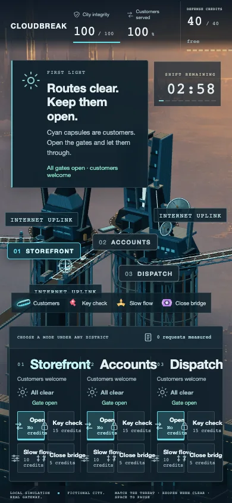
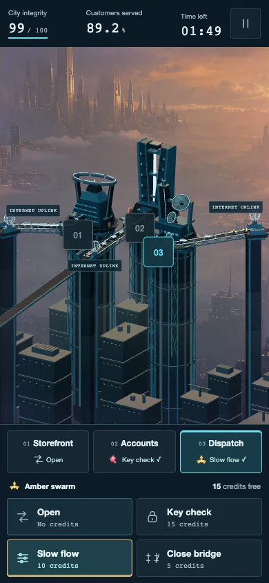
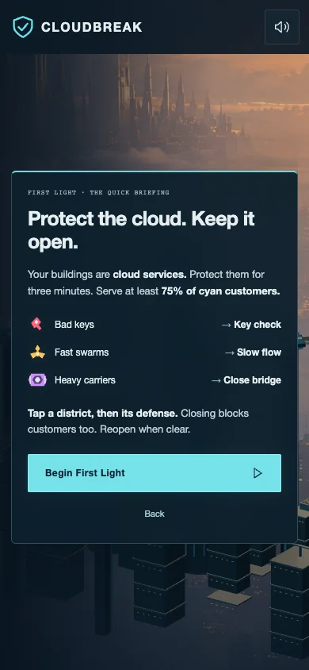
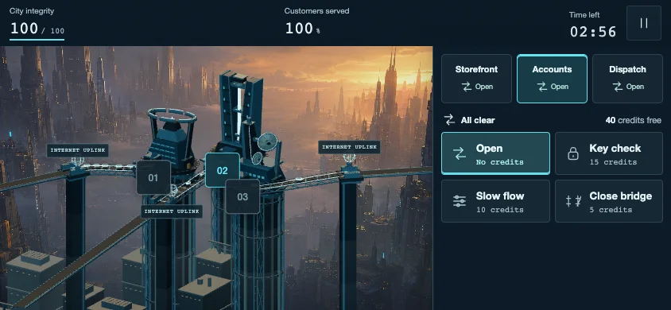
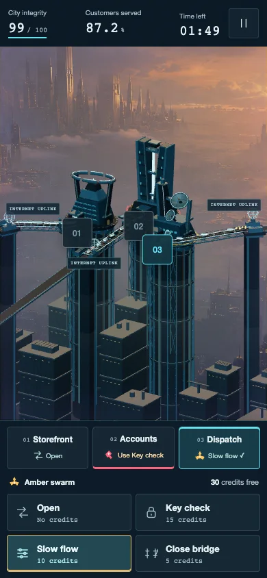
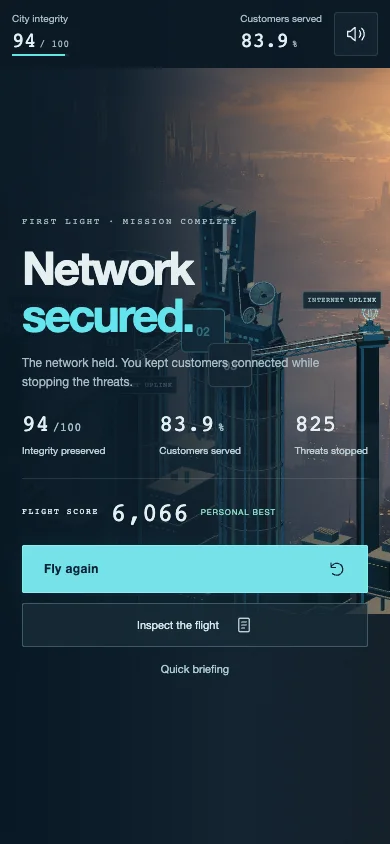

# A simpler phone interface

Nicholas found the released desktop dashboard crowded on his phone and asked to simplify it while preserving the gameplay. The phone interface now keeps three district selectors visible and shows four large defenses for the selected district. Other threats remain visible, and incoming attacks never change the player's selection. The short briefing, compact status bar, and Pause settings leave more space for the city. Landscape phones put the controls beside it.

[Play Cloudbreak](https://cloudbreak.onrender.com/)

## Before and after

These are actual browser screenshots at 390 by 844 CSS pixels, exported as WebP without changing their content. The before capture required starting in the desktop layout because decorative title text intercepted the phone's start button. It shows the original twelve-button dashboard after resizing back to phone dimensions. The after capture uses the redesigned touch interface during a real mission with simultaneous attacks.

 

## Quick briefing and landscape

## Live public verification

The [fresh public report](public/report.json) is the final verification record for this update. It checks the deployed game at its normal Render address. The automated touch run completed in 180.357 real seconds, with 93.2 integrity and 897 of 1,068 customers served, or 83.99 percent. All 1,961 completed request records reconciled with the counters. All eight layouts, both small briefings, overlapping attacks, and the post-flight controls passed, with no browser errors or geometry warnings. The [live asset check](public-assets.json) also confirms the deployed mobile stylesheet exactly matches the tested build.

 

## What was checked

The earlier September 7, 2026 [local verification summary](report.json) records eight playing layouts: 320 by 568, 360 by 640, 375 by 667, 390 by 844, 430 by 932, two landscape phones, and the 1280 by 900 desktop layout. The two smallest briefings were checked separately. Mobile gameplay controls have touch targets at least 44 CSS pixels across, with no page overflow. Desktop retains twelve direct defense controls.

An automated three-minute mission used real touch input, the unchanged server clock, and real gateway responses. It finished with 94 integrity and 903 of 1,059 customers served, or 85.27 percent. All 1,948 completed request records reconciled with the counters. The run covered every threat type, overlapping district alerts, credit refunds, pause, sound settings, help, final mute controls, request inspection, and restarting. Browser errors and geometry warnings were empty. The existing 53 automated tests and the TypeScript production build also passed.

The local summary identifies a report-recovery and screenshot-timing issue during preparation. The fresh public report above was saved directly by the completed run, and its results image waits for the actual results panel.

These checks used Chrome's phone emulation, not physical phones or mobile Safari. They establish the tested layout and touch behavior; they do not establish battery life, real-device frame rate, screen-reader usability, or every browser's address-bar and safe-area behavior. Attack announcements remain in an accessible live region, but no assistive-technology session was performed. The original PNG captures listed in the report are retained locally; the selected WebP exports above are included here.

Run the responsive checks against an isolated local preview with `node scripts/check-mobile.mjs`. Set `FULL_RUN=1` to include the real 180-second mission. The script also accepts the exact public game address through `CLOUDBREAK_CHECK_URL`; it creates its own browser session.
