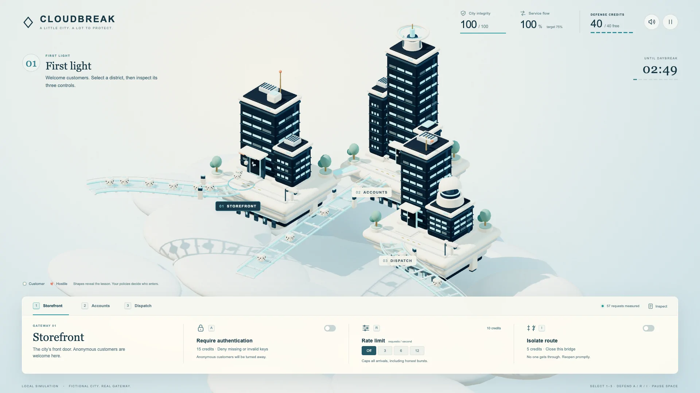
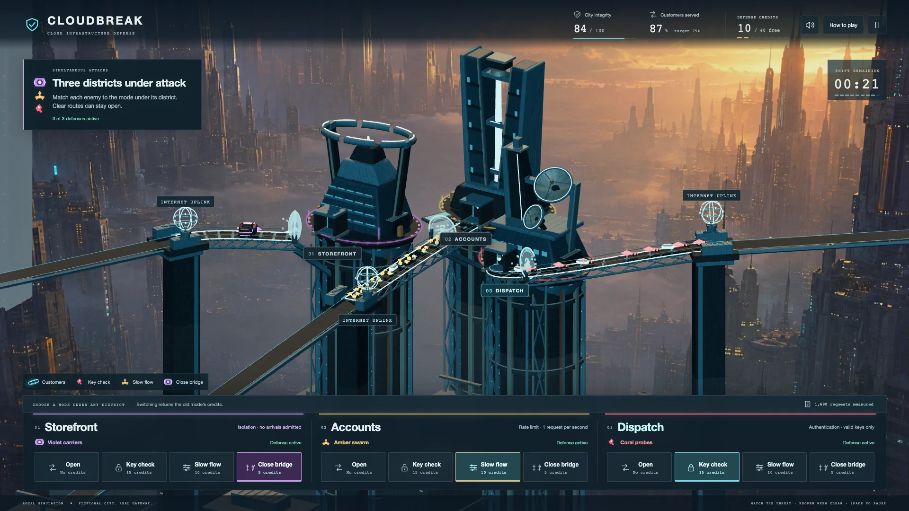

# How I built Cloudbreak with Codex

I wanted to make the choices involved in protecting a cloud service easier to understand. A city gave those choices something visible to affect: customers arriving, attacks approaching, and buildings that needed to stay online.

I used Codex as my development partner. I set the direction, played the builds, reviewed the visuals and sound, and described what felt confusing or frustrating. Codex implemented the changes, wrote and ran checks, and captured the actual game for review. This project grew through that back-and-forth.

## Finding the right city

The early version had navy buildings, pale bridges, and soft white clouds. I liked the general design, but the little white customers looked like dice. They did not communicate Internet traffic. The buildings also needed to feel more futuristic.

*An actual early gameplay capture. The customer shapes, pale environment, and original control panel all changed after review.*

Once I liked the gameplay loop, I asked for a different visual direction: a huge futuristic city above a gritty undercity, with luminous enemies and more industrial character. The vertical scale of The Fifth Element and the neon colors of Tron were references for the mood, rather than assets to copy.

The new background worked for me. The three playable buildings still felt too ordinary, so I asked for distinct technology landmarks. The bridges needed another pass too. They seemed to lead nowhere, with supports hanging underneath them.

That led to the current three-building skyline, connected approaches, and foundations descending into the lower city. The distant city is a generated background image. The playable buildings, roads, gates, and traffic are interactive Three.js geometry. [The background prompt and provenance](../public/art/PROVENANCE.md) keep that distinction explicit.

*Actual revision-eight gameplay. Different threats are active in all three districts, and each defense is visible beneath its building.*

## Making the decisions readable

At first I did not understand the flow well enough. I understood turning on authentication, but the reasons to use a rate limit or isolate a route were less clear.

I asked for three visibly different attackers with different reasons to choose a defense. Coral probes have invalid keys. Amber swarms arrive in volume with valid keys. Violet carriers arrive slowly with valid keys but cause much more damage when admitted.

That gave the controls a clearer purpose. Authentication refuses the bad key. Rate limiting reduces the rush. Isolation stops every arrival on that route, at a cost to customers.

The tutorial also made me click through too many things before I could play. I wanted a quick explanation and a faster start. We replaced the locked practice sequence with a short briefing and put direct defense buttons under each building. Warnings now stay in the world while the mission continues.

Later attacks move between locations and overlap. That was another request from my playthroughs: defending one predictable building at a time was less interesting than deciding what each service needed while several things happened together.

## What felt wrong during play

The first balance was too punishing. A relatively reasonable run could finish close to losing the city. I asked for a more forgiving result, either through recovery or lower damage. We chose lower damage, with swarms doing less harm per arrival and carriers remaining the threat that needs full containment. Integrity does not regenerate.

Slow flow also needed to reduce the swarm enough to feel useful. Its current preset admits a sustained rate of one request per second. It can still admit a hostile request, so it does not claim to be a complete barrier.

Gates felt slow, and activating a defense appeared to reset the enemies already approaching it. That undermined the decision: I wanted to change what happened at the gate, not make the visible line start again.

The repair separated an approaching request from its eventual response. The same request identity continues toward the gate. When it arrives, the game's server issues its actual HTTP request under the policy active at that moment. The measured response determines what happens next. A later policy change does not rewrite a request that has already passed.

Damage needed a quieter visual treatment too. Whole-screen shake looked like a problem with the game. Now only the struck building moves briefly and lights up. Reduced motion keeps the lighting without the displacement.

Traffic seemed to appear halfway down the track. I asked where it would come from in the real world. That question became the Internet uplinks, shared by customers and attacks. Every displayed approach begins at an uplink. The renderer may omit a request that arrives too late to show a clear approach, but it does not discard that request's actual result.

These were small observations with consequences for both the game and the explanation. If a visual suggests that a control erased traffic or that a threat came from nowhere, it teaches the wrong relationship even when the numbers underneath are correct.

## Getting the sound right

Repeated collision effects became tiring. I asked for distinct sounds for each enemy type that would fit a futuristic city and remain comfortable when heard often.

The background music took a separate set of auditions. The first alternatives were too calm. I wanted the sense that I was actively defending a system. I selected **Firewall Drive**, an original electronic score with a driving pulse and rising intensity. Codex produced the arrangements and integrated the selected music alongside the separate effects.

That distinction mattered: the problem with a repeated collision thump did not mean the whole score should avoid rhythm.

## Checking the rules underneath

React and TypeScript provide the interface, and Three.js renders the city. The server authors the traffic, owns mission state, enforces the credit budget, and sends actual HTTP requests through the game's gateway.

The gateway checks the active policy, credentials, and route rate-limit state. It does not receive the generator's friendly or hostile classification. Only after the response arrives does the game join that private label to count customer service or fictional damage.

The checks cover invalid and missing credentials, a valid-key attacker passing authentication, rate-limit refill, isolation, legitimate service after reopening, budget handling, pause, restart, and approaching request continuity. Browser checks examine the result a player sees, including fast gates, clear uplink origins, local damage, and reduced motion.

The historical revision-eight checkpoint passed 46 gameplay tests. A separate normal-time local mission finished with 82.9 integrity and 923 of 1,062 customers served, about 87 percent. Its 1,956 completed HTTP records reconciled with the counters and damage. That is a measured example, not a promise about every player's score or public hosting performance.

That earlier browser run also checked that approaching requests kept their identities during defense changes and that damage moved only the struck building. Its recording averaged about 24 frames per second, with occasional capture gaps. The gameplay result and the recording quality are separate findings. Later release checks cover the selected music, public hosting, and new demonstration.

## The connection to my work

My experience with software-as-a-service implementation, documentation, onboarding, and troubleshooting gives me a practical way to approach this subject. I am used to thinking about what someone needs to do, where the workflow breaks, how to explain a change, and how to check that it helped.

For this project, that meant turning playthrough feedback into requirements and checking both sides of the outcome. Did the unwanted request stop? Could legitimate customers still use the service? Was the reason understandable without a long explanation?

Cloudbreak models those questions with deliberately simple rules. It does not represent a production Azure or Amazon Web Services deployment, and making it does not establish production security experience or measured learning outcomes. It is a playable way to explore the tradeoff between protection and availability, and to show how I work through a confusing technical experience until it makes more sense.

— Nicholas
